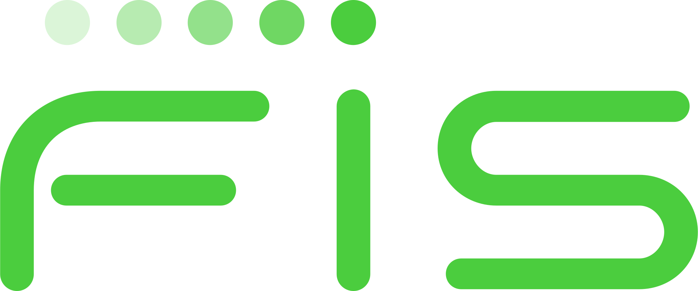

<h1 align="center">Hi there 👋</h1>

I'm a Software Engineer passionate about building impactful systems, with a strong academic background and work experience across industry-leading tech companies and academia.

---
💼 **Working experience**

-  &nbsp; **Software Engineer** at **Microsoft**
  - *Full-time, On-site — Belgrade*
  - *April 2025 – Present*
  - Member of the **Azure Compute Node Service** team.
-  &nbsp; **Software Engineer** at **Cisco**
  - *Full-time, On-site — Belgrade*
  - *May 2024 – March 2025*
  - Part of the **System Integration Platform** team.   
-  **Software Engineer** at **SYRMIA**
  - *Full-time, On-site — Belgrade*
  - *April 2023 – April 2024*
  - Part of the **System Software** team.
-  &nbsp; **Software Engineer Intern** at **FIS**
  - *Full-time, On-site — Belgrade*
  - *November 2022 – January 2023*
  - Part of the **Plum** team (C# team).
-  &nbsp; **Teaching Associate** at the **Faculty of Mathematics, University of Belgrade**
  - *Part-time, On-site — Belgrade*
  - *October 2022 – September 2024*
  - Department of Computer Science and Informatics. 

---

🎓 **Education**

- **PhD Student** of Informatics at the **Faculty of Mathematics, University of Belgrade**
  - *October 2024 – Present*
  - Grade: 10.0/10.0
  - Some of chosen majors: Advanced Topics in Computer Networks, Advanced Topics in Compiler Construction, Advanced Topics In Software Verification, Machine Learning in Computer Vision. 
- **Master’s Degree** in Informatics at the **Faculty of Mathematics, University of Belgrade**
  - *October 2022 – September 2024*
  - Grade: 9.71/10.0
  - Master thesis title: **Automatic detection and optimization of the CRC algorithm within the LLVM compiler infrastructure**
  - Some of chosen majors: Software Verification, Software Development 2, Scientific Computing, Machine Learning, Cryptography. 
- **Bachelor’s Degree** in Computer Science at the **Faculty of Mathematics, University of Belgrade**
  - *October 2018 – September 2022*
  - Grade: 9.25/10.0
  - Some of mandatory majors: Operating Systems, Computer Architecture, Database Programming, Computer Networks.

 
---

📫 **How to reach me**

- 
- 

---

💻 **Languages and Tools:**

---

📊 **GitHub Stats**

  

  

